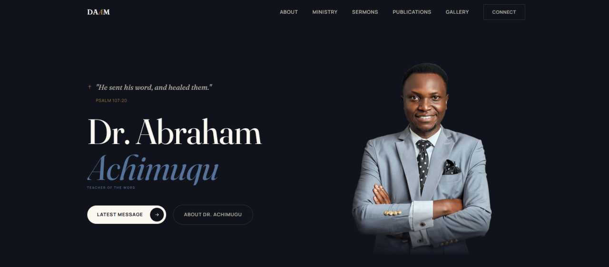

# Ministry_website

# Dr. Abraham Achimugu Ministries Website

A modern and responsive ministry website built for Dr. Abraham Achimugu Ministries (DAAM). The project focuses on creating a clean, accessible, and engaging experience for visitors while presenting the ministry's vision and activities.

## Features

- Responsive landing page
- Hero section
- About section
- Ministry arms
- Contact section
- Clean and modern UI

## Tech Stack

- HTML5
- CSS3
- JavaScript

- ## Preview

## Project Status

🚧 This project is currently under active development. More sections and functionality are being added.

## Author

Utih Joseph Favour
